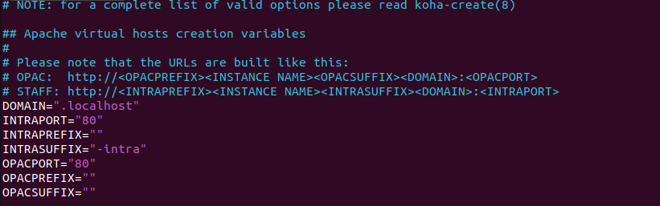
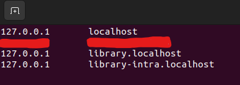

In der heutigen Lerneinheit haben wir die Metadatenstandards MARC21, sowie dessen Äquivalent im XML-Format MARCXML und auch Dublin Core angeschaut. 
In einem zweiten Teil befassten wir uns noch mit dem Bibliotheksmanagementsystem Koha, mit welcher wir auch eine kurze Übung unternommen hatten. 
Nebst einem kurzen Vergleich von Dublin Core und MARC21 werde ich diesen Blogeintrag eher Koha widmen. Dies, da im Unterricht ein Fehler auftauchte bei der Nutzung und ich in der Unterrichtsfreienzeit noch einen Versuch unternommen habe, eine Installation von Koha durchzuführen, werde ich dies hier dokumentieren und weiter darauf eingehen. 
Da ich bei der Installtion und der Konfiguration einige Fehler hatte, welche ich beheben musste, diese jedoch gerne festhalten möchte, wird dieser Blogpost allerdings auch etwas länger als andere es wohl sein werden.


# Dublin Core - MARC21
Was die Lesbarkeit der beiden Metadatenstandards anbelangt, muss ich persönlich sagen, empfinde ich Dublin Core als deutlich einfacher zu lesen. Die Tags haben meist sehr einfache, aussagekräftige Namen, welche schnell darauf hinweisen, was der Inhalt der jeweiligen Metadaten vermitteln soll. Bei MARC21 wurden Felder ID's vergeben, was alles deutlich einheitlicher macht, dennoch kann man sich hier auch nicht sicher sein, dass alles ohne Abweichungen festgehalten wurden. Im Unterricht haben wir einige Statistiken dazu angeschaut, wie stark die einzelnen Abweichungen in verschiedenen Bibliotheken sind, wobei ich es interessant fand, dass es wortwörtlich zwischen 0 und 100 eigentlich alles gab. Die Resultate wurden in [dieser](https://docs.google.com/presentation/d/e/2PACX-1vRU4J_rln00UVD7pNPT0_02NOad0HfSk_UKqRI0v29y8QkMAplEDlyjc0Ot_VE_paV6WBW29Fh_V-iN/pub?start=false&loop=false&delayms=3000&slide=id.g574306292a_0_35) Präsentation aufgezeigt. Ich persönlich fand es auch interessant, dass eine solche Erhebung gemacht wurde, da Metadatenstandards eigentlich dafür da sein sollten, um ein gemeinsames Verständnis und einen einfacheren Austausch zu schaffen. Da bei MARC21 so viele Felder schon so genau vordefiniert wurden, dachte ich bisher, dass dies eigentlich kein grosses Problem darstellen sollte. Bei Dublin Core erwartete ich da eher noch Probleme, da Dublin Core 15 Hauptelemente enthält, jedoch oft auch erweitert wird, um es dem Use Case anzupassen. 


# Koha Installation auf localhost 

Ursprünglich wollte ich die Installation im Subsystem for Linux (WSL) durchführen, jedoch stiess ich schon auf Probleme, bei der Installation der WSL. Windows meldete mir stetig, dass ich die nötigen Windows Features noch nicht aktiviert hatte, was jedoch der Fall war und auch die Virtualisierung im BIOS war aktiviert. Daher entschied ich mich nach einer Weile, die Installation in einer Virtuellen Maschine umzusetzen, um nicht weiter Zeit zu verschwenden. Die Linux Distribution, welche 
hierfür verwendet wurde ist Ubuntu 22.04 und als Virtual Box Version wurde die Version 7.0.14 verwendet. Mein Laptop hat als Betriebssystem Windows 11 mit der Version 23H2 installiert und dient somit als Host für die Virtuelle Maschine. Als Referenz für die Koha Installation wurde die Anleitung verwendet, welche im gemeinsamen Dokument bereits verlinkt war. Jedoch ist hierbei zu beachten, dass ich nicht alle Schritte durchgeführt habe und auch nicht ganz alle notwendig sind.
Alle Links für Downloads und Anleitungen, welche ich im Laufe dieses Versuchs verwendet habe, befinden sich am Ende des Beitrags.


## Anforderungen an die VM und Konfiguration
Für die Ubuntu Desktop VM werden die folgenden Minimalanforderungen vorgeschlagen, um die Virtuelle Maschine ohne Stocken zu starten: 

- Prozessor: 2 (virtuelle CPU Kerne) 
- RAM: 4096 MB => 4GB
- Storage: 25GB

Ich habe meiner VM ungefähr das selbe zugewiesen. Prozessor und RAM habe ich den Minimal Anforderungen aus dem Blog Post der Ubuntu Community entnommen. Für den Storage habe ich etwas mehr zugewiesen (35GB) mit dem Hintergedanken, dass noch mariadb bzw mysql installiert werden muss und somit eine Datenbank Instanz. Daraus folgend würde diese Datenbank dann auch Einträge enthalten und Koha, sowie Ubuntu Desktop selbst nehmen auch noch Platz ein. Um kommende Platzprobleme daher zu vermeiden, wiess ich der VM 35 GB Speicher zu. Im Endeffekt, nach dem Test, habe ich trotzdem nur 15.09 GB verbraucht, jedoch habe ich auch nicht viele Datensätze angelegt. 

Ein letzter Punkt ist noch die Netzwerk Konfiguration für den Netzwerk Adapter in Virtual Box. Zuerst war dieser standardmässig für mich auf NAT (Network Address Translation) eingestellt. Diese Einstellung funktionierte für mich persönlich jedoch nicht, weswegen ich die Einstellung umschaltete auf den Bridged Adapter. Hier muss bedacht werden, dass dies für jede Person anders sein kann, daher sollte die Internet Verbindung zuerst getestet werden. Ich persönlich habe dies gemacht als Ubuntu Desktop aufgesetzt war und dann habe ich Firefox gestartet, um die Koha Installationsanleitung zu öffnen. Da die Seite nicht laden wollte und ich eine Fehlermeldung erhielt, dass die Seite nicht erreichbar sei, habe ich auf den Bridged Adapter umgeschalten und danach hat alles funktioniert. 

## Installation

Gleich beim Start der Installationsanleitung musste ich einen Teil abändern und konnte diesen nicht 1:1 aus der Anleitung übernehmen.  
```sh 
echo deb http://debian.koha-community.org/koha stable main | sudo tee /etc/apt/sources.list.d/koha.list
```
musste ich abändern zu
```sh 
echo deb http://debian.koha-community.org/koha stable main | sudo tee /etc/apt/sources.list
```  
Wenn die Repository Source in ein weiteres File (koha.list) geschrieben wird, habe ich die Erfahrung gemacht, dass Fehler auftreten, wenn der apt install Befehl ausgeführt werden soll später. Daher habe ich das Repository gleich zu der sources.list hinzugefügt und danach noch den gpg key heruntergeladen. Wenn das durchgeführt wurde, habe ich noch die Sourcen aktualisiert, alle bereits installierten Pakete aktualisiert und Koha gleich installiert mit dem folgenden Befehl:
```sh
apt update && apt upgrade -y && apt install -yf koha-common mariadb-server
```
Die Flag -f war für mich in diesem Fall sehr hilfreich da ich Koha nicht wirklich kannte und -f alle dependencies, die noch benötigt werden, mitinstalliert. Daher musste ich mir dann keine Gedanken machen, ob noch etwas bei der Grundinstallation nicht mitinstalliert wurde, was noch von nöten wäre, da -f dies eigentlich gleich detektieren sollte. Die -y flag habe ich nur noch gesetzt, damit ich nicht immer alles noch mit Y + Enter bestätigen musste und alles gleich automatisiert durchlief. 
Die Einstellung, um den Datenbank Server sicherer zu machen habe ich in diesem Fall übersprungen, da ich diese Instanz nur lokal laufen lassen werde und die Testinstallation nach der einmaligen Nutzung auch wieder gelöscht wird. Falls es sich hierdings allerdings um eine produktive Umgebung handelt für eine Bibliothek, dann kann dieser Befehl gut noch ausgeführt werden, um allfälllige Versuche für einen remote root Zugriff zu verhindern.  

## Konfiguration Koha

  
Um die Seite schliesslich auf localhost aufrufbar zu machen, habe ich bei der Variable DOMAIN als TLD .localhost angegeben. Dies sorgt hinterher dafür, dass die Instanz aufrufbar ist als Unterseite von localhost mit der URL instanz.localhost  
Das Intra Suffix definiert noch wie auf den Staff Bereich zugegriffen werden kann. In dem Fall bedeutet dies allgemein instanz-intra.localhost  
Die Instanz habe ich hier in diesem Beispiel einfach library genannt wodurch sich die folgenden beiden URL's ergaben.  

- library.localhost
- library-intra.localhost

Um noch den web Installer hinterher im Browser über die URL zu erreichen, welche ich vordefiniert habe, musste ich schliesslich noch die /etc/hosts Datei entsprechend anpassen. Bei mir sah dies dann bspw so aus:   
 

Alternativ kann auch ein DNS Server eingerichtet werden, mit Services wie bind9. Allerdings habe ich hier für dieses Beispiel darauf verzichtet, da es auch sehr gut ohne ging und daher eher unnötig war dies auch noch zu machen. 

Danach folgt nur noch das Setup von Koha über den Web Installer. Dies verlief mit Hilfe der Doku einwandfrei. Da ich es das erste Mal konfigurierte, musste ich allerdings mehr Zeit damit verbringen die einzelnen Konfigurationscheckboxen genau durchzulesen. 
Hinterher konnte ich mich dann mit dem Testuser, den ich erstellt habe, gleich einloggen und ein Buch erfassen. Beim weiteren Ausprobieren habe ich nun auch herausgefunden, wie sich das Checkout verhält. 
Dies muss über die jeweilige Person ausgeführt werden. Daher ist der beste Weg dies durchzuführen, auf die Person zu klicken, dann links auf Checkout und hinterher kann der Barcode des Buches eingegeben werden. In der Maske Checkout werden allerdings nicht alle ausgeliehenen Medien angezeigt, es bleibt eine leere Seite, was mich doch etwas verwundert hat. Ich hätte erwartet, dass die Seite dann eine Übersicht anzeigt von allen Medien, welche ausgeliehen sind. Womöglich auch in Form einer Tabelle, die gefiltert werden kann nach Datum, Kunde o.ä. 
Sobald die Ausleihe gemacht wurde, kann die Rückgabe dann aber auch gemacht werden, durch das erneute eintippen des Barcodes. Hier war ich zuerst unsicher ob es überhaupt funktioniert hat, da es gar nichts gemacht hat in meiner Hinsicht bzw. da ich kein Feedback bekam, weswegen ich nochmal bestätigte. Dann erhielt ich eine Fehlermeldung, dass das Medium nicht ausgeliehen ist. Irgendeine Form von Bestätigung, dass die Rückgabe erfolgt wurde, wäre dort gut gewesen, damit nicht zweimal gedrückt wird. In einer produktiven Umgebung könnte ich mir vorstellen, dass dies sonst zu Verzögerungen führt, wenn dies öfters vorkommt. Kunden und Kundinnen müssten dann dadurch auch länger in einer Warteschlange anstehen, wenn für jedes Medium dies immer wieder passiert und so Zeit verschwendet wird. 


Zeichen: 9'644

## Verwendete Downloads und Anleitungen

[Ubuntu VM ISO Download](https://ubuntu.com/download/desktop)  
[Installationsanleitung für Koha](https://openschoolsolutions.org/how-to-install-and-set-up-koha-for-schools-part-1/)  
[Minimal Requirements Ubuntu Desktop](https://help.ubuntu.com/community/Installation/SystemRequirements)  
[Koha Circulation - Checkout Funktion erklärt](https://koha-community.org/manual/17.05/html/05_circulation.html)