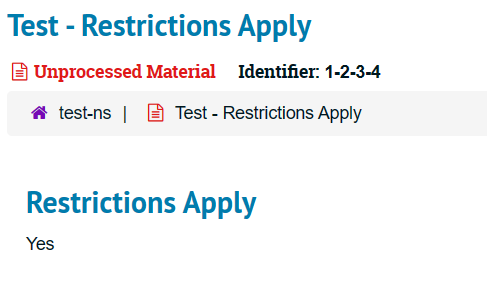

Dieser Beitrag umfasst den Inhalt der dritten Lerneinheit, welche am Nachmittag des 5. März und am Nachmittag des 12. März behandelt wurde. In diesem Teil haben wir uns mit dem Metadatenstandard ISAD(G), welcher in Archiven verwendet wird und dem Datenformat EAD befasst. Zudem haben wir eine Übung gemacht, in welcher wir Bibliothekskataloge und Archivskataloge verglichen haben und eine weitere Übung mit ArchivesSpace, um die Software kennenzulernen. 

# ISAD(G)
Das Regelwerk Internation Standard Archival Description (General), oder auch kurz ISAD(G), wurde 1994 vom ICA Commisison on Descriptive Standards (ICA/DDS) eingeführt. Prägend bei diesem Standard und dieser Art der Erschliessung ist, dass es eine mehrstufige Verzeichnung gibt. Diese Erschliessung erfolgt nach dem Provenienz Prinzip.
ISAD(G) hat 26 Verzeichniselementen, welche in 7 'Informationsbereichen' unterteilt sind. Von den gegebenen Feldern gibt es auch Pflichtfelder, welche als 'besonders wichtig' empfunden werden und somit immer ausgefüllt werden. In diesen Pflichtfeldern findet sich auch die Provenienz wieder, in welcher erfasst wird, woher die Materialen kommen bzw. in welchen Händen diese zuvor waren. 
Ein gutes Beispiel fand ich hierzu gleich dieses, welches im Unterricht gebracht wurde. Dieses hat mir sehr geholfen, um die Verwendung des Feldes bzw. einen allgemeinen Anwendungsfall aufgezeigt zu bekommen.  
Als Beispiel wurde der Zusammenhang von Literaturwissenschaftlerinnen mit den Archivsystemen gebracht. Diese können anhand der erschlossenen Daten und mit moderner Plagiatssoftware rückverfolgen, welche Schriftstellende sich bei welchen anderen Schriftstellenden zuerst inspirieren haben lassen.

Zusätzlich fand ich die Grafik für die Verzeichnisebenen sehr hilfreich, da ich bisher immer etwas Schwierigkeiten hatte, die einzelenen Ebenen zu unterscheiden. Die Grafik visualisiert die Ebenen allerdings sehr einfach und verständlich. 

 Hierarchie Verzeichnisstufen")

Da in ISAD(G) hierarchisch erfasst wird, sieht man in dieser Grafik sehr schnell, auf welcher Ebene man sich befindet bzw. zu welcher Ebene etwas gehört. Da ich persönlich nicht aus dem Archivbereich komme und nur die wenigen Erfahrungen im Bereich Erschliessen aus dem Studium habe, dient diese Darstellung sehr als Unterstützung für zukünftige Arbeiten in diesem Bereich. Bisher habe ich auch 'File' immer nur als Einzelstück angesehen und die 'Series' als die Mappe. Das Beispiel, um die zusätzliche Unterteilung zwischen 'File' und 'Item' für die Mappe mit den Einzelstücken (bspw. Notizzetteln) darin, welche dann zu einer inhaltlichen Sammlung (Series), welcher ein Nachlass einer Person ist (Fonds) zu erklären, machte die Hierarchie dann noch deutlich verständlicher. 

# Übung Vergleich Archivsystem und Bibliotheksmanagementsystem
Bei der Übung haben wir zwei Archivkataloge verglichen und schlussendlich noch die zentralen Unterschiede zwischen Bilbiothekskatalogen und Archivskatalogen gesammelt. 
Hierbei nehme ich als zentraler Unterschied zwischen den beiden mit, dass bei Archiven der Gesamtzusammenhang / die ganze Sammlung beschrieben wird, so dass die Provenienz, der Kontext und der Inhalt nachvollziehbar sind. Bei den Bibliotheken ist es mehr eine medienzentrierten, systematischen Erschliessung. Das heisst, dass ein physikalisches Objekt mit einem Datensatz beschrieben wird.

# EAD
Das letzte Thema das wir behandelt haben ist das Austauschformat Encoded Archival Description (EAD), welches ein XML Standard ist. Von diesem gibt es verschiedene Versionen, die Versionen, die am weitesten verbreitet sind, sind die Versionen EAD2002 und EAD3. Je nachdem wo man arbeitet bedeutet dies dann, dass man sich achten muss, welche Version des Standards verwendet wurde, da dies wichtig ist, unter anderem für die Importskripte, welche verwendet werden.
Hierbei fand ich interessant, dass als Anwendungsfälle genannt wurde, dass dies für Archivportale verwendet wird. Ich habe dann noch Kalliope etwas weiter durchgeforscht und für die EAD Dateien Beispiel Dateien, sowie eine Dokumentation gefunden, welches die Mindestanforderungen dokumentiert. Dies war unter anderem die Frage, welche ich mir zuerst gestellt habe, ob für die Ablieferung auch Standards und Mindestanfoderungen gestellt werden, damit diese sauber übertragen werden können ohne viel Nachbearbeitungsaufwand. Die Dokumentation hält allerdings sehr viel fest. Bspw. wie dass einzelne Elemente benannt werden müssen für Daten, Titel, Personennamen etc. aber auch wann für was Attribute verwendet werden sollen. 

# ArchivesSpace
ArchivesSpace ist eine Open Source Software für Archiveinformationssysteme, welche allerdings im Gegensatz zu Koha eine Art Mischform gewählt haben. Bei ArchivesSpace gibt es Inhalte, welche nur für zahlende Mitglieder zur Verfügung stehen, wobei der Code allerdings immer noch öffentlich zugänglich ist, wodurch es sich formal immer noch als Open Source definiert. Ergänzend zu dem Handbuch von ArchivesSpace gibt es noch das Handbuch, welches die Universität von New York geschrieben und veröffentlicht hat. 

Im Unterricht haben wir mit ArchivesSpace noch eine Übung gemacht, bei der wir Datensätze erstellen sollten in Gruppen. In der Gruppe, in welcher ich zugeteilt war, hatten wir zuerst noch ein Verständnisproblem beim Erstellen des Datensatzes. Im Formular wurden die beiden Checkboxen 'Restrictions Apply?' und 'Access Restrictions?' angezeigt, jedoch konnten wir uns nicht direkt erklären, mit welchem die Restrictions nun in Kraft treten würden. Beim Ausprobieren im Selbststudium und bei der weiteren Recherche, bin ich dann daraufgestossen, dass dies lediglich identifier sind und sich nichts ändert wenn diese angewählt werden.   

Den Eintrag spezifisch für Restrictions Apply habe ich auf [dieser Seite](https://duspeccoll.github.io/archivesspace/resources) gefunden. Für das Feld Access Restrictions habe ich dies nicht mehr gefunden, jedoch fand ich ein [PDF](https://www2.archivists.org/sites/all/files/OK%20State%20U%20Using%20ArchivesSpace.pdf), welches die Felder noch beschrieb und darin, lässt sich ebenfalls das Feld 'Access Restrictions' wiederfinden. Wenn für dieses das selbe ausprobiert wird, wie zuvor mit dem Restrictions Apply, lässt sich sehen, dass auch einfach eine Meldung angezeigt wird, dass gewisse Restriktionen bestehen. Allerdings werden diese nicht gleich angewendet, dies müsste wohl an einem anderen Ort gemacht werden. Hierzu fehlt mir dann allerdings der tiefere Einblick in die Dokumentation und das System.  

Zeichen: 6'340