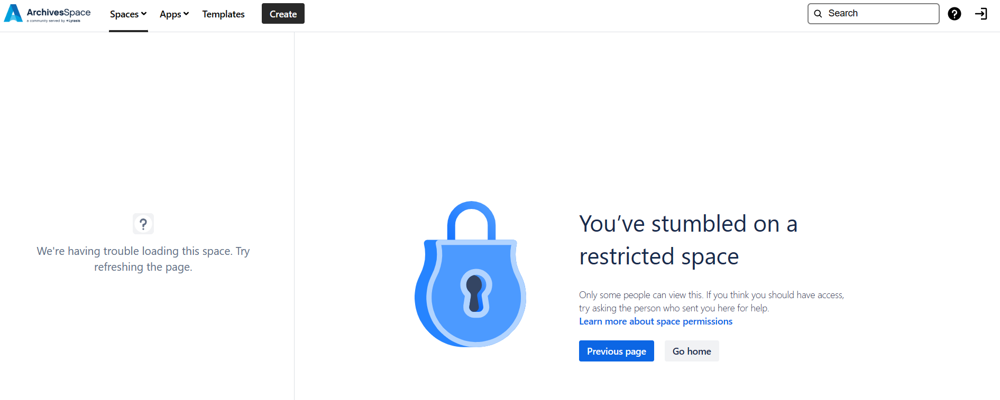
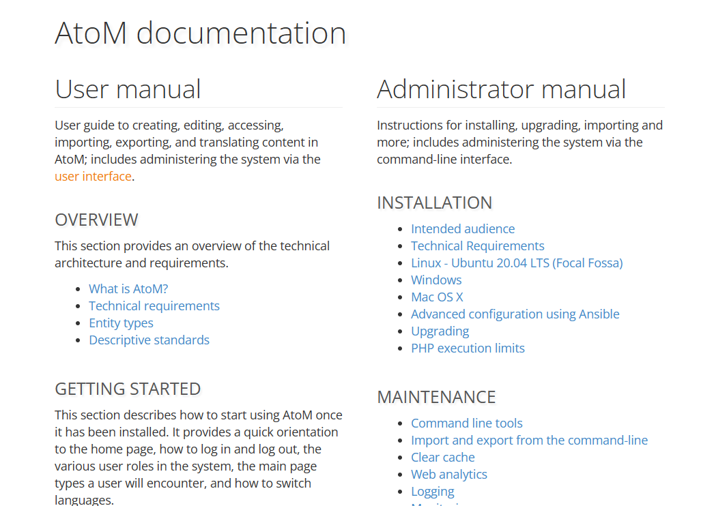

Die folgende Übung befasst sich mit den Archivsystemen ArchivesSpace und Access to Memory (AtoM). Hierfür habe ich die Demo Versionen für die beiden Anwendungen verwendet.   

# Nutzung von ArchivesSpace
Bei der Nutzung von ArchivesSpace fiel mir sehr schnell auf, dass das Help Center, welches überall verlinkt ist, nicht zugänglich ist. Dies liegt höchstwahrscheinlich an der Mischvariante zwischen Bezahl- und Open Source Methode, welche ArchivesSpace gewählt hat, so dass die offizielle Dokumentation (HelpCenter im Confluence) nicht zugänglich ist aus der Demo, selbst wenn man als Admin Demo User eingeloggt ist.  

Für die Nutzung war dies etwas mühsam, da dieses HelpCenter überall wieder verlinkt wurde, bspw auch wenn ein neues Digitales Objekt angelegt werden soll. Beim Durchklicken fand ich es dennoch nötig eine Anleitung zu haben, welche grundlegend gewisse Felder oder Funktionen erklärt. Die Mouse Over Funktion, welche bereits implementiert ist, half da schon ein bisschen, aber falls es weiter geht bspw um gewisse Unterschiede zwischen verschiedenen Feldern zu verstehen, wäre eine Dokumentation von nöten. In der Dokumentation im [Confluence](https://archivesspace.atlassian.net/wiki/spaces/ADC/overview) fand ich persönlich nichts hilfreiches, was die Bedienung in solch einem Fall vereinfacht hätte. Die inoffizielle [Dokumentation](https://docs.google.com/document/d/11kWxbFTazB6q5fDNBWDHJxMf3wdVsp8cd7HzjEhE-ao/edit) der Universität von New York hat mir allerdings deutlich weiterhelfen können. Was auch gleich dient, ist dass sowohl das Tool als auch die Dokumentation auf Englisch waren. Dadurch konnten die Begriffe gleich in der Dokumentation gesucht werden. Dadurch konnte ich noch das allfällige Problem umgehen, dass ich bestimmte Fachbegriffe, welche mir vielleicht nur auf Deutsch bekannt waren, noch suchen musste. 

# Nutzung von Access to Memory
Im Vergleich zu ArchivesSpace ist die Dokumentation von AtoM frei verfügbar und umfasst diverse Anleitungen, wie bspw. wie eine eigene AtoM Instanz bereitgestellt werden und danach auch verwaltet werden kann. 

Viele Unterschiede zu ArchivesSpace fand ich in AtoM nicht. Etwas das mir direkt auffiel ist, dass die Provenienz in AtoM nicht direkt als 'Provenance' angeschrieben ist, wie in ArchivesSpace sondern als 'Donor/Transferring body area'.  
Ich persönlich empfand das Format wie es in AtoM gelöst wurde angenehmer, da dort die Einträge vordefiniert waren, welche ausgewählt werden konnten. In ArchivesSpaces ist es ein Freitextfeld, was auch sehr dienen kann. Jedoch nutze ich Freitextfelder generell weniger gerne, da in diesen Tippfehler passieren können und sich damit die Einträge schliesslich unterschieden können. Wenn dann nach der Provenienz gesucht wird und die Suche Case-Sensitive ist, stellt dies wiederum ein Problem dar. Ich habe dies dann noch einmal ausprobiert, indem ich zwei Akzessionen erstellt habe in ArchivesSpace und im Freitextfeld bei 'Provenence' absichtlich die Herkunft unterschiedlich geschriben habe. Als ich die Herkunft schliesslich im Suchfeld eingegeben habe, zeigt es mir beide an. 

Zeichen: 2'944